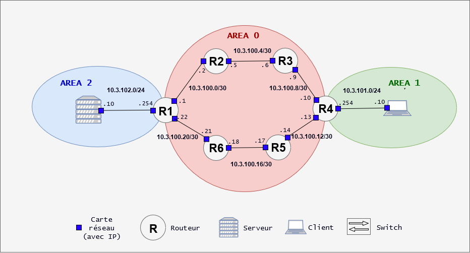
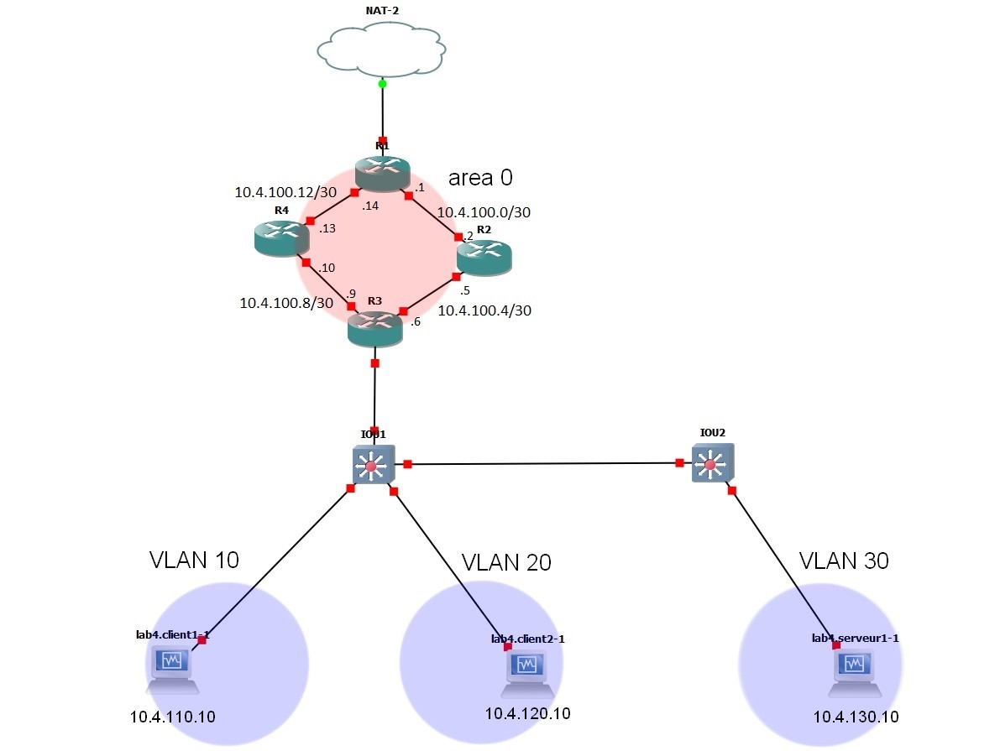

# B2 Réseau 2018 - TP3

# TP 3 - Utilisation de matériel Cisco 

Dans ce TP on va mettre en place des topologies un peu plus intéressantes. Pour ce faire on va avoir besoin de :
* **GNS3** : 
  * pour virtualiser des routeurs
* **routeurs**
  * gestion du routage entre les différents réseaux
  * permettre un accès à internet
  * dans tout le TP, les "routeurs" seront des Cisco 3640
* **switches**
  * gestion des VLANs
  * permet aux clients d'accéder au réseau
  * dans tout le TP, les "switches" seront des iOU Cisco

On va mettre en place plusieurs labs pour y aller petit à petit.  

Pour le dernier lab, vous devrez imaginer une topo qui remet en place tout ce qu'on a vu jusqu'à maintenant. Mais si ça va être fun.

# Sommaire

* [I. Manipulation de switches et de VLAN](#i-manipulation-de-switches-et-de-vlan)
  * [1. Mise en place du lab](#1-mise-en-place-du-lab)
  * [2. Configuration des VLANs](#2-configuration-des-vlans)
* [II. Manipulation simple de routeurs](#ii-manipulation-simple-de-routeurs)
  * [1. Mise en place du lab](#1-mise-en-place-du-lab-1)
  * [2. Configuration du routage statique](#2-configuration-du-routage-statique)
* [III. Mise en place d'OSPF](#iii-mise-en-place-dospf)
  * [1. Mise en place du lab](#1-mise-en-place-du-lab-2)
  * [2. Configuration de OSPF](#2-configuration-de-ospf)
* [IV. Lab Final](#iv-lab-final)
* [Annexe 1 : NAT dans GNS3](#annexe-1--nat-dans-gns3)

---

# I. Manipulation de switches et de VLAN
# 1. Mise en place du lab

#### > Topologie
```
client1           SW1                  SW 2
+----+         +-------+            +-------+
|    +---------+       +------------+       |
+----+         +---+---+            +---+---+
                   |                    |
                   |                    |
                   |                    |
                   |                    |
                +--+-+               +--+-+
                |    |               |    |
                +----+               +----+
               client2               client3
```

#### > Tableau d'adressage

Hosts | `10.1.1.0/24`
--- | ---
`client1.lab1.tp3` | `10.1.1.1/24`
`client2.lab1.tp3` | `10.1.1.2/24`
`client3.lab1.tp3` | `10.1.1.3/24`


C'est GNS 3 qui gère l'interface réseau donc on rajoute juste ce dont on a besoin dans `/etc/sysconfig/network-scripts/ifcfg-enps03` :
```
BOOTPROTO=static
IPADDR=10.1.1.1
NETMASK=255.255.255.0
```

#### > Vérification
* [X] Nom de domaines sur toutes les machines
  ```
  sudo hostname <hostname>
  echo '<hostname>' | sudo tee /etc/hostname
  ```
  ici, pour **client1** on a :
  ```
  [arnaud@localhost ~]$ hostname --fqdn
  client1.lab1
  ```
* [X] Toutes les machines doivent pouvoir se `ping`
  * Après 3h de bataille avec GNS 3, il s'est avéré que les Switch avaient juste magiquement disparrus de notre espace-temps. Mais au final ça marche
  * Tout le monde se ping yey...

# 2. Configuration des VLANs

Mettez en place les VLANs comme suit : 
* les ports avec un VLAN clairement assigné sont les ports destinés aux clients
  * ce sont les ports **en mode access**
* les ports entre deux switches sont les ports en **mode trunk**
```
client1           SW1                  SW 2
+----+  VLAN10 +-------+    TRUNK   +-------+
|    +---------+       +------------+       |
+----+         +-------+            +-------+
                   |VLAN20              |VLAN10
                   |                    |
                   |                    |
                   |                    |
                +--+-+               +--+-+
                |    |               |    |
                +----+               +----+
               client2               client3

```
#### Configuration pour **Switch1**
  * Création des VLANs
    ```
    IOU1#conf t
    IOU1(config)#vlan 10
    IOU1(config-vlan)#name VLAN10

    IOU1(config)#vlan 20
    IOU1(config-vlan)#name VLAN20
    ```
  * Affectation des VLANs aux bonnes interfaces
    ```
    IOU1(config)#interface Ethernet 0/1
    IOU1(config-if)#switchport mode access
    IOU1(config-if)#switchport access vlan 10

    IOU1(config)#interface Ethernet 0/2
    IOU1(config-if)#switchport mode access
    IOU1(config-if)#switchport access vlan 20
    ```
  * Mise en place du Trunk entre les deux switchs
    ```
    IOU1(config)#interface Ethernet 0/0
    IOU1(config-if)#switchport trunk encapsulation dot1q
    IOU1(config-if)#switchport mode trunk
    ```
#### Configuration pour **Switch2**
  * Création du VLAN
    ```
    IOU1#conf t
    IOU1(config)#vlan 10
    IOU1(config-vlan)#name VLAN10
    ```
  * Affectation du VLAN
    ```
    IOU1(config)#interface Ethernet 0/1
    IOU1(config-if)#switchport mode access
    IOU1(config-if)#switchport access vlan 10
    ```
  * Mise en place du Trunk entre les deux switchs
    ```
    IOU1(config)#interface Ethernet 0/0
    IOU1(config-if)#switchport trunk encapsulation dot1q
    IOU1(config-if)#switchport mode trunk
    ```

#### > Vérification
* [X] `client1.lab1.tp3` peut joindre `client3.lab1.tp3`
  * `ping` et/ou `traceroute`
   ```
   [arnaud@client1 ~]$ sudo traceroute -I 10.1.1.3
    1   10.1.1.3 (10.1.1.3)  69.331 ms  69.425 ms  69.314 ms
   ```
* [X] `client2.lab1.tp3` n'est joignable par personne
   ```
   [arnaud@client1 ~]$ sudo traceroute -I 10.1.1.3
    1   client1.lab1 (10.1.1.1)  3007.178 ms !H  3006.512 ms !H  3006.506 ms !H
   ```

---

# II. Manipulation simple de routeurs

Utilisation de routeurs Cisco pour cette partie, on va mettre en place un routage statique simple. Cela permettra à des hôtes dans des réseaux différents de pouvoir se joindre.

## 1. Mise en place du lab

#### > Topologie
```
                           10.2.12.0/30

                  router1                router2
client1          +------+               +------+
+----+.10        |      |.1           .2|      |.254     .10+----+
|    +-----------+      +---------------+      +------------+    |
+----+           +------+               +------+            +----+
                     |.254                                  server1
                     |
                     |
                     |
   10.2.1.0/24       |                         10.2.2.0/24
                     |.11
                  +----+
                  |    |
                  +----+
                  client2

```

#### > Réseau(x)

Nom | Adresse
--- | ---
`lab2-net1` | `10.2.1.0/24`
`lab2-net2` | `10.2.2.0/24`
`lab2-net12` | `10.2.12.0/30`

#### > Tableau d'adressage

Hosts | `lab2-net1` |  `lab2-net2` |  `lab2-net12` 
--- | --- | --- | ---
`client1.lab2.tp3` | `10.2.1.10/24` | x | x
`client2.lab2.tp3` | `10.2.1.11/24` | x | x
`server1.lab2.tp3` | x | `10.2.2.10/24` | x
`router1.lab2.tp3` | `10.2.1.254/24` | x | `10.2.12.1/30`
`router2.lab2.tp3` | x | `10.2.2.254/24` | `10.2.12.2/30`

* Configuration des Routeurs, exemple pour **Routeur1**
  ```
  //Mise en place de l'interface pour le réseau /30 des routeurs

  R1#conf t
  Enter configuration commands, one per line.  End with CNTL/Z.
  R1(config)#interface f0/0
  R1(config-if)#ip address 10.2.12.1 255.255.255.252
  R1(config-if)#no shut
  R1(config-if)#exit
  R1(config)#
  *Mar  1 00:14:35.671: %LINK-3-UPDOWN: Interface FastEthernet0/0, changed state to up
  *Mar  1 00:14:36.671: %LINEPROTO-5-UPDOWN: Line protocol on Interface FastEthernet0/0, changed state to up


  //Mise en place de l'interface dans le réseau /24 des clients

  R1(config)#interface f2/0
  R1(config-if)#ip address 10.2.1.254 255.255.255.0
  R1(config-if)#no shut
  R1(config-if)#exit
  R1(config)#
  *Mar  1 00:15:59.783: %LINK-3-UPDOWN: Interface FastEthernet2/0, changed state to up
  *Mar  1 00:16:00.783: %LINEPROTO-5-UPDOWN: Line protocol on Interface FastEthernet2/0, changed state to up
  ```
* Configuration des Clients, exemple pour **Client1**
  ```
  [arnaud@localhost ~]$ echo 'client1' | sudo tee /etc/hostname

  [arnaud@localhost ~]$ cat /etc/sysconfig/network-scripts/ifcfg-enp0s3
  ...
  BOOTPROTO=static
  IPADDR=10.2.2.10
  NETMASK=255.255.255.0
  ```
* Configuration du Server, **Server1**
  ```
  [arnaud@localhost ~]$ echo 'serveur1' | sudo tee /etc/hostname

  [arnaud@localhost ~]$ cat /etc/sysconfig/network-scripts/ifcfg-enp0s3
  ...
  BOOTPROTO=static
  IPADDR=10.2.2.10
  NETMASK=255.255.255.0
  ```

#### > Vérification
* Suite à de mystiques problèmes de connexio n SSH je ne puis insérer de copié-collé des pings donc je vais mettre des screens...
* [X] les clients et serveurs peuvent joindre leurs gateways respectives
  
  * C'est **Client1** qui ne peut pas joindre **Routeur1**
* [X] les routeurs peuvent discuter entre eux
  

## 2. Configuration du routage statique

Sur toutes les machines :
* ajouter une route vers `lab2-net1` et `lab2-net2` à toutes les machines qui ne les ont pas déjà
  * **Client2** `lab2-net2` :
    ```
    sudo ip route add 10.2.2.0/24 via 10.2.1.254 dev enp0s3
    ```
  * **Serveur1** `lab2-net1` :
    ```
    sudo ip route add 10.2.1.0/24 via 10.2.2.254 dev enp0s3
    ```
  * **Routeur1** `lab2-net2` :
    ```
    router1(config)#ip route 10.2.2.0 255.255.255.0 10.2.12.2
    ```
  * **Routeur2** `lab2-net1` :
    ```
    router2(config)#ip route 10.2.1.0 255.255.255.0 10.2.12.1
    ```
* **PAS DE ROUTES A AJOUTER VERS `lab2-net12`**
  * vos routeurs connaissent déjà la route, puisqu'ils y sont directement connectés
  * et personne d'autre n'a besoin de la connaître

#### > Vérification
* [X] tous les clients et serveurs peuvent se joindre
  * sauf le client qui n'a pas de passerelle
    
    
  
  * proposez une topologie où tous les clients auraient la même passerelle (vous avez le droit d'ajouter des équipements)
    * Je crois que j'ai pas compris pourquoi mais **Routeur1** ne veux parler qu'à une personne donc on va mettre un multi-prise au milieu qui fera messager. Donc on a besoin d'invoquer un switch.

#### > Nouvelle Topologie
```
                           10.2.12.0/30

                  router1                router2
10.2.1.0/24      +------+               +------+
            .254 |      |.1           .2|      |.254     .10+----+
          -------+      +---------------+      +------------+    |
          |      +------+               +------+            +----+
          |                                                  server1
        +-+---------------+
        |                 | switch1
        +----+-------+----+
             |       |                         10.2.2.0/24
             |.10    |.11
          +----+  +----+
          |    |  |    |
          +----+  +----+
        client1   client2

```
---

# III. Mise en place d'OSPF

Dès qu'on atteint un certain nombre de routeurs, le routage statique atteint très vite ses limites : c'est extrêment long et fastidieux. Par conséquent, c'est un terrain propice à l'erreur humaine et c'est très difficile à maintenir. De plus nous n'avons aucun calcul de route optimale.  

Les protocoles de routage dynamique permettent entre autres de résoudre ces problèmes. Nous étudierons [le protocole OSPF](../../cours/3.md#ospf) dans ce TP. 

## 1. Mise en place du lab

#### > Topologie

<br><p align="center">
  
</p>

#### > Tableau d'adressage

Hosts | `10.3.100.0/30` | `10.3.100.4/30` | `10.3.100.8/30` | `10.3.100.12/30` | `10.3.100.16/30` | `10.3.100.20/30` | `10.3.101.0/24` | `10.3.102.0/24`
--- | --- | --- | --- | --- | --- | --- | --- | --- 
`client1.lab3.tp3` | x | x | x | x | x | x | `10.3.101.10/24` | x 
`server1.lab3.tp3` | x | x | x | x | x | x | x | `10.3.102.10/24` 
`router1.lab3.tp3` | `10.3.100.1/30` | x | x | x | x | `10.3.100.22/30` | x | `10.3.102.254/24` 
`router2.lab3.tp3` | `10.3.100.2/30` | `10.3.100.4/30` | x | x | x | x | x | x 
`router3.lab3.tp3` | x | `10.3.100.5/30` | `10.3.100.9/30` | x | x | x | x | x 
`router4.lab3.tp3` | x | x | `10.3.100.10/30` | `10.3.100.13/30` | x | x | `10.3.101.254/24` | x 
`router5.lab3.tp3` | x | x | x | `10.3.100.14/30` | `10.3.100.17/30` | x | x | x 
`router6.lab3.tp3` | x | x | x | x | `10.3.100.18/30` | `10.3.100.21/30` | x | x 

* On a deja fait de la conf de routeurs et de VMs 15 fois, je n'en remet pas

#### > Vérification
* [X] les clients et serveurs peuvent joindre leurs gateways respectives
  * **client1**
  ```
  [arnaud@client1 ~]$ ping 10.3.101.254
  PING 10.3.101.254 (10.3.101.254) 56(84) bytes of data.
  64 bytes from 10.3.101.254: icmp_seq=1 ttl=255 time=96.3 ms
  64 bytes from 10.3.101.254: icmp_seq=2 ttl=255 time=25.9 ms
  ^C
  --- 10.3.101.254 ping statistics ---
  3 packets transmitted, 2 received, 33% packet loss, time 2003ms
  rtt min/avg/max/mdev = 25.951/61.168/96.386/35.218 ms
  ```
  * **serveur1**
  ```
  [arnaud@serveur1 ~]$ ping 10.3.102.254
  PING 10.3.102.254 (10.3.102.254) 56(84) bytes of data.
  64 bytes from 10.3.102.254: icmp_seq=1 ttl=255 time=26.9 ms
  64 bytes from 10.3.102.254: icmp_seq=2 ttl=255 time=21.0 ms
  ^C
  --- 10.3.102.254 ping statistics ---
  3 packets transmitted, 2 received, 33% packet loss, time 2003ms
  rtt min/avg/max/mdev = 21.090/24.020/26.950/2.930 ms
  ```
* [X] les routeurs peuvent discuter entre eux (de point à point)
  * je vais montrer que le ping de **routeur1** vers **routeur2**, c'est la même chose à chaque fois
  ```
  R1#ping 10.3.100.2

  Type escape sequence to abort.
  Sending 5, 100-byte ICMP Echos to 10.3.100.2, timeout is 2 seconds:
  .!!!!
  Success rate is 80 percent (4/5), round-trip min/avg/max = 8/32/68 ms
  ```
  * Tout est OK (comme d'habitude, le premier packet perdu pour l'ARP)
  

## 2. Configuration de OSPF  

Sur chaque routeur (pour les exemples, on regardera **routeur1**): 
* activer ospf
  ```
  R1#conf t
  Enter configuration commands, one per line.  End with CNTL/Z.
  R1(config)#router ospf 1
  ```
* définir un `router-id` qui correspond au numéro du routeur
  * `1.1.1.1` pour **router1**
  * `2.2.2.2` pour **router2**
  ```
  R1(config-router)#router-id 1.1.1.1
  ```
* partager **tous** les réseaux auxquels le routeur est connecté 
  * les `/30` et les `/24`
  * avec une commande `network`
  ```
  R1(config-router)#network 10.3.100.0 0.0.0.3 area 0
  R1(config-router)#network 10.3.100.20 0.0.0.3 area 0
  R1(config-router)#network 10.3.102.0 0.0.0.255 area 2
  ```

Sur le client et le serveur :
* ajouter une route par défaut qui pointe vers leurs passerelles respectives
  * **client1** : `[arnaud@client1 ~]$ sudo ip route add default via 10.3.101.254`
  * **serveur1** : `[arnaud@serveur1 ~]$ sudo ip route add default via 10.3.102.254`

#### > Vérification
* [X] tous les routeurs peuvent se joindre
  * **routeur1** peut ping **routeur4** (les autres routeurs se pingent aussi mais je vais mettre tout les rapports...)
  ```
  R1#ping 10.3.100.10

  Type escape sequence to abort.
  Sending 5, 100-byte ICMP Echos to 10.3.100.10, timeout is 2 seconds:
  !!!!!
  Success rate is 100 percent (5/5), round-trip min/avg/max = 8/60/100 ms
  ```
* [X] **cleint1** peut joindre **server1**
  ```
  [arnaud@client1 ~]$ ping 10.3.102.10
  PING 10.3.102.10 (10.3.102.10) 56(84) bytes of data.
  64 bytes from 10.3.102.10: icmp_seq=1 ttl=60 time=100 ms
  64 bytes from 10.3.102.10: icmp_seq=2 ttl=60 time=117 ms
  64 bytes from 10.3.102.10: icmp_seq=3 ttl=60 time=112 ms
  64 bytes from 10.3.102.10: icmp_seq=4 ttl=60 time=160 ms
  ^C
  --- 10.3.102.10 ping statistics ---
  4 packets transmitted, 4 received, 0% packet loss, time 3003ms
  rtt min/avg/max/mdev = 100.248/122.407/160.307/22.717 ms
  ```

---

# IV. Lab Final

Le dernier lab a pour objectif de remettre en pratique tout ce qui a été vu jusqu'à maintenant. Votre infra doit comprendre les critères suivants :  


**1. comporter plusieurs routeurs Cisco**  
* ils doivent utiliser **[OSPF](../../cours/procedures-cisco.md#définir-une-ip-statique#ospf)**
* une seule aire sera utilisée : l'aire de backbone (area 0)  

**2. comporter plusieurs switches Cisco**  
* ils doivent mettre en place des **VLANs** sur tous les port utilisés
  * *access* ou *trunk*
* comporter plusieurs VLANs
  * au moins 2 : `clients` et `servers`  

**3. permettre aux clients du réseau (client et serveurs) d'accéder à Internet grâce à la [fonctionnalité NAT](../../cours/lexique.md#nat--network-address-translation)**  
* cela sera fait avec le NAT de GNS3
* vous trouverez en [Annexe 1](#annexe-1--nat-dans-gns3) un document pour la mise en place du NAT dans GNS3
* [la mise en place du NAT avec un routeur Cisco est dispo ici](../../cours/procedures-cisco.md#nat)  

**4. comporter un service d'infra**  
* se référer au [TP précédent](../2/README.md#ii-nat-et-services-dinfra)
* pour accéder à internet, vous devez utiliser le NAT mis en place précédemment  

**5. si vous voulez permettre aux clients de joindre le réseau des serveurs, il faudra faire du *routage inter-vlan***  
* c'est stylé et en vrai c'est pas beaucoup de configuration
* je vous conseille une topologie avec un *router-on-a-stick*  

Je vous conseille de vous organiser pour ne pas que ce soit l'enfer
* faites des configurations peristentes partout (pour pas tout perdre en cas de reboot)
* utilisez un outil comme [draw.io](https://www.draw.io/) et faites un schéma de votre topologie
* faites un tableau d'adressage IP
* *faites tout ça, sinon, vraiment, c'est une torture le réseau*

**N'hésitez pas à me soumettre votre topologie avant de vous lancer.**

---

## Objectif

<br><p align="center">
  
</p>

* Tableau d'adressage
Hosts | `10.4.110.0/24` |  `10.4.120.0/24` |  `10.4.130.0/24` | `10.4.100.0/30` | `10.4.100.4/30` | `10.4.100.8/30` | `10.4.100.12/30`
--- | --- | --- | --- | --- | --- | --- | ---
`client1` | `10.4.110.10/24` | x | x | x | x | x | x
`client2` | x | `10.4.120.10/24` | x | x | x | x | x
`server1` | x | x | `10.4.130.10/24` | x | x | x | x
`router1` | x | x | x | `10.4.100.1/30` | x | x | `10.4.100.14/30`
`router2` | x | x | x | `10.4.100.2/30` | `10.4.100.5/30` | x | x
`router3` | x | x | x | x | `10.4.100.6/30` | `10.4.100.9/30` | x
`router4` | x | x | x | x | x | `10.4.100.10/30` | `10.4.100.13/30`

## Let's go !

## 1. Conf des routeurs
* Exemple pour **routeur1**
  * Définition des IPs
    ```
    R1#conf t
    Enter configuration commands, one per line.  End with CNTL/Z.
    R1(config)#interface f0/0
    R1(config-if)#ip address 10.4.100.1 255.255.255.252
    R1(config-if)#no shut
    R1(config-if)#exit
    R1(config)#
    *Mar  1 00:10:03.819: %LINK-3-UPDOWN: Interface FastEthernet0/0, changed state to up
    *Mar  1 00:10:04.827: %LINEPROTO-5-UPDOWN: Line protocol on Interface FastEthernet0/0, changed state to up

    R1(config)#interface f1/0
    R1(config-if)#ip address 10.4.100.14 255.255.255.252
    R1(config-if)#no shut
    R1(config-if)#exit
    R1(config)#
    *Mar  1 00:11:41.983: %LINK-3-UPDOWN: Interface FastEthernet1/0, changed state to up
    *Mar  1 00:11:42.983: %LINEPROTO-5-UPDOWN: Line protocol on Interface FastEthernet1/0, changed state to up
    ```
  * Mise en place de l'OSPF
    ```
    R1#conf t
    Enter configuration commands, one per line.  End with CNTL/Z.
    R1(config)#router ospf 1
    R1(config-router)#router-id 1.1.1.1
    R1(config-router)#network 10.4.100.0 0.0.0.3 area 0
    R1(config-router)#network 10.4.100.12 0.0.0.3 area 0
    ```
  * Mise en place et teste de la connexion internet (uniquement sur **routeur1** cette fois)
    ```
    R1#conf t
    Enter configuration commands, one per line.  End with CNTL/Z.
    R1(config)#interface f2/0
    R1(config-if)#ip address dhcp
    R1(config-if)#no shut
    R1(config-if)#
    *Mar  1 01:28:37.479: %LINK-3-UPDOWN: Interface FastEthernet2/0, changed state to up
    *Mar  1 01:28:38.479: %LINEPROTO-5-UPDOWN: Line protocol on Interface FastEthernet2/0, changed state to up
    R1(config-if)#
    *Mar  1 01:28:48.215: %DHCP-6-ADDRESS_ASSIGN: Interface FastEthernet2/0 assigned DHCP address 192.168.122.54, mask 255.255.255.0, hostname R1
    R1(config)#exit


    //check qu'on a bien recup une ip en dhcp

    R1#show ip int br
    ...
    FastEthernet2/0            192.168.122.54  YES DHCP   up                    up
    ...


    //on regarde si on a bien une passerelle

    R1#show ip route
    ...
    Gateway of last resort is 192.168.122.1 to network 0.0.0.0
    ...

    
    //ping google pour voir si ça marche bien

    R1#ping 8.8.8.8
    Type escape sequence to abort.
    Sending 5, 100-byte ICMP Echos to 8.8.8.8, timeout is 2 seconds:
    !!!!!
    Success rate is 100 percent (5/5), round-trip min/avg/max = 24/75/168 ms
    ```

  * Mise en place du NAT
    ```
    R1#conf t
    R1(config)#interface f0/0
    R1(config-if)#ip nat inside
    R1(config-if)#exit

    R1(config)#interface f1/0
    R1(config-if)#ip nat inside
    R1(config-if)#exit

    R1(config)#interface f2/0
    R1(config-if)#ip nat outside
    R1(config-if)#exit

    R1(config)#ip nat inside source list 1 interface f2/0 overload
    R1(config)#access-list 1 permit any
    ```
    On informe tout le monde via OSPF que **Routeur1** est la passerelle par defaut pour accéder à internet.
    ```
    R1(config)#router ospf 1
    R1(config-router)#default-information originate
    ```
    Check que ça à bien marcher
    ```
    R3#ping 8.8.8.8

    Type escape sequence to abort.
    Sending 5, 100-byte ICMP Echos to 8.8.8.8, timeout is 2 seconds:
    !!!!!
    Success rate is 100 percent (5/5), round-trip min/avg/max = 12/26/52 ms
    ```

## 2. Conf des Switchs
  * Configuration de **Switch1**
    * **S1** sera configuré en mode `access` entre **client1** et **client2**...
      ```
      Switch1(config)#vlan 10
      Switch1(config-vlan)#name compta
      Switch1(config-vlan)#exit

      Switch1(config)#vlan 20
      Switch1(config-vlan)#name admin
      Switch1(config-vlan)#exit

      Switch1(config)#interface e0/2
      Switch1(config-if)#switchport mode access
      Switch1(config-if)#switchport access vlan 10
      Switch1(config-if)#exit

      Switch1(config)#interface e0/3
      Switch1(config-if)#switchport mode access
      Switch1(config-if)#switchport access vlan 20
      Switch1(config-if)#exit
      ```
    * ... et en mode `trunk` entre **S2** et **Routeur3**
      ```
      Switch2(config)#interface e0/0
      Switch2(config-if)#switchport trunk encapsulation dot1q
      Switch2(config-if)#switchport mode trunk
      Switch2(config-if)#exit

      Switch2(config)#interface e0/1
      Switch2(config-if)#switchport trunk encapsulation dot1q
      Switch2(config-if)#switchport mode trunk
      Switch2(config-if)#exit
      ```
  * Configuration de **Switch2**
    * **S1** sera configuré en mode `access` entre **client3**...
      ```
      Switch1(config)#vlan 30
      Switch1(config-vlan)#name serveurs
      Switch1(config-vlan)#exit

      Switch1(config)#interface e0/2
      Switch1(config-if)#switchport mode access
      Switch1(config-if)#switchport access vlan 30
      Switch1(config-if)#exit
      ```
    * ... et en mode `trunk` entre **S1**
      ```
      Switch2(config)#interface e0/1
      Switch2(config-if)#switchport trunk encapsulation dot1q
      Switch2(config-if)#switchport mode trunk
      Switch2(config-if)#exit
      ```

    * Inter-vlanning
      on va découper l'interface de **Routeur3** dans le réseau des VMs en 3 morceaux, sous-interfaces
      ```
      R3#conf t
      R3(config)#interface f2/0.1
      R3(config-subif)#encap dot1q 10
      R3(config-subif)#ip add 10.4.110.254 255.255.255.0
      R3(config-subif)#no shut
      R3(config-subif)#exit

      R3(config)#interface f2/0.2
      R3(config-subif)#encap dot1q 20
      R3(config-subif)#ip add 10.4.120.254 255.255.255.0
      R3(config-subif)#no shut
      R3(config-subif)#exit

      R3(config)#interface f2/0.3
      R3(config-subif)#encap dot1q 30
      R3(config-subif)#ip add 10.4.130.254 255.255.255.0
      R3(config-subif)#no shut
      R3(config-subif)#exit

      ```

## 3. Conf des VMs
  * Hostnames
    ```
    [arnaud@localhost ~]$ echo 'client1' | sudo tee /etc/hostname

    [arnaud@localhost ~]$ echo 'client2' | sudo tee /etc/hostname

    [arnaud@localhost ~]$ echo 'serveur1' | sudo tee /etc/hostname
    ```

  * IPs (exemple pour **client1**)
    ```

    [arnaud@client1 ~]$ cat /etc/sysconfig/network-scripts/ifcfg-enp0s3
    ...
    BOOTPROTO=static
    IPADDR=10.4.110.10
    NETMASK=255.255.255.0
    GATEWAY=10.4.110.254
    ```

Les VMs peuvent maintenant ce ping.

## 4. Installation d'un service d'infra (serveur web)

* Installation de `nginx` sur **server1** :

    ```
    sudo yum install nginx
    ```

* On ouvre le port 80 du firewall en tcp :

    ```
    sudo firewall-cmd --add-port=80/tcp --permanent
    sudo firewall-cmd --reload
    ```

* Sur les VMs clientes ont peut faire un wget vers **server1** :

    * Exemple sur **client1** :
    ```
    [arnaud@lclient1 ~]$ wget 10.4.130.10
    --2019-03-31 18:02:38-- http://10.4.130.10/
    HTTP request sent, awaiting response... 200 OK
    Length: 3700 (3.6K) [text/html]
    Saving to: 'index.hml.1'

    100%[==========================================================>] 3,700         --.--L/s    in 0s

    2019-03-31 18:02:39 (402 MB/s) - 'index.html.1' saved [3700/3700]
    ```


