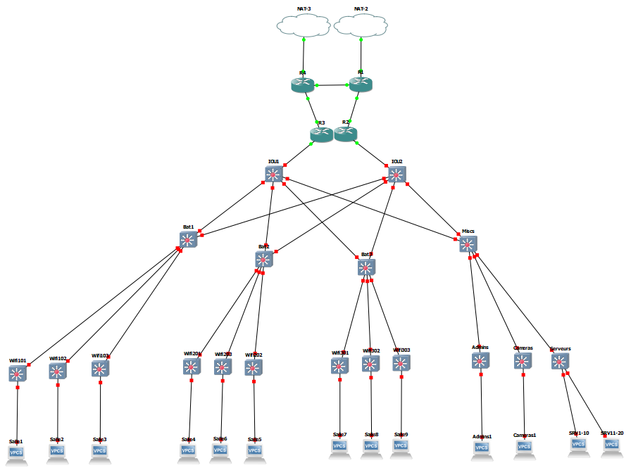
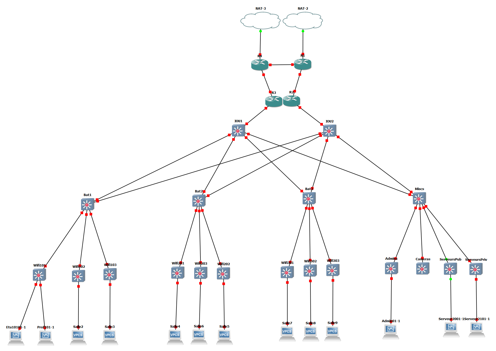

# Le projet : Menu 2, Infra Campus

J'ai choisi ce projet car il me semblais être celui le plus à ma porté et puis je trouve sympa de monter un gros truc comme une infra de campus, ça me fait penser à des Légos je sais pas pourquoi.
Mais je trouver sa fun donc c'est partit.

Etant donné que l'infra est tout de même assez massive pour être virtualisé completement sur un seul PC, j'ai choisi de la rétrécir une peu.

2PC par salles (1 prof, un étudiant), 1 salle par batiment et 3 batiments plus 2 serveurs, 1 admin et 1 caméra.
Ainsi, on passe de près de 300 machines à une dizaine de machines, 4 routeurs et quelques switchs.

## Avancement du projet
  Dans l'onglet [`Projects`](https://github.com/ArnaudDauguen/CCNA2/projects/1) du git, vous pourrez trouver un Kanban recapitulant l'avancement du projet.


## Objectif

<br><p align="center">
  
</p>


## Tableaux d'adressage

Hosts | `10.4.100.0/30` | `10.4.100.4/30` | `10.4.100.8/30` | `10.4.100.12/30`
--- | --- | --- | --- | ---
`router1` | `10.4.100.1` | x | x | `10.4.100.14`
`router2` | `10.4.100.2` | `10.4.100.5` | x | x
`router3` | x | `10.4.100.6` | `10.4.100.9` | x
`router4` | x | x | `10.4.100.10` | `10.4.100.13`


* Les salles sont isolée de façon à empecher les petits génies d'embeter leurs collègues.
* On va faire des (trop) gros réseau, comme ça on a de la place pour plus tard, si on veux rajouter des machines


VLAN | nom | réseau | description
--- | --- | --- | ---
`101` | `etu101` | `10.4.11.0/25` | `étudiants batiment 1 salle 1`
`102` | `etu102` | `10.4.12.0/25` | `étudiants batiment 1 salle 2`
`103` | `etu103` | `10.4.13.0/25` | `étudiants batiment 1 salle 3`
`...` | `...` | `...` | `...`
`309` | `etu309` | `10.4.39.0/25` | `étudiants batiment 3 salle 9`
`310` | `etu310` | `10.4.40.0/25` | `étudiants batiment 3 salle 10`
`501` | `profs` | `10.4.101.0/24` | 
`10` | `admins` | `10.4.201.0/28` | 
`20` | `serveurs1` | `10.4.202.0/27` | `serveurs publiques (pour les étudiants)`
`21` | `serveurs2` | `10.4.203.0/27 ` | `serveurs privés (pour les profs/admins)`
`30` | `cameras` | `10.4.204.0/27` | 


## Matériel requis

Materiel | quantite | commentaire
--- | --- | ---
`cables` | `65` | 
cables | `32` | `batiment pricipal, abritant les routeurs et serveurs`
cables | `30` | `1 par salle (de la borne wifi au switch du batiment)`
cables | `3` | `Les 3 batiments ne sont pas forcement juste à côté donc les relier par cable ne me semble pas très safe (ni faisable) mais dans la maquette c'est le cas`
||
`bornes wifi` | `30` | `autant que de salles`
`switchs` | `10` | `Architecture 3-tier`
`routeurs` | `4` | `dont 1 pour la redondance`


## Installation de l'infra

### Routeurs
Comme pour le dernier TP on va faire une boucle avec les **routeurs** mais cette fois on va mettre en place la redondance via **HSRP** (entre les **router2** et **router3**)

* Configuration de base (ip et OSPF (OSPF sert a rien ici mais je sais faire donc je le met pour le TP :D ))
    ```
    R1#conf t
    R1(config)#interface f0/0
    R1(config-if)#ip address 10.4.100.1 255.255.255.252
    R1(config-if)#no shut
    R1(config-if)#ip nat inside
    R1(config-if)#exit

    R1(config)#interface f1/0
    R1(config-if)#ip address 10.4.100.14 255.255.255.252
    R1(config-if)#no shut
    R1(config-if)#ip nat inside
    R1(config-if)#exit

    R1(config)#interface f3/0
    R1(config-if)#ip address dhcp
    R1(config-if)#no shut
    R1(config-if)#ip nat outside
    R1(config-if)#exit

    R1(config)#ip nat inside source list 1 interface f3/0 overload
    R1(config)#access-list 1 permit any

    R1(config)#router ospf 1
    R1(config-router)#router-id 1.1.1.1
    R1(config-router)#network 10.4.100.0 0.0.0.3 area 0
    R1(config-router)#network 10.4.100.12 0.0.0.3 area 0
    // R1 routeur par défaut (pour internet) via OSPF
    R1(config-router)#default-information originate

    R1#copy running-config startup-config
    ```

    [Tester internet](https://github.com/It4lik/B2-Reseau-2018/tree/master/tp/3#Annex)

* Configuration des VLANs (sur **R3** et **R2**)

  ```
  R3#conf t
  R3(config)#interface f2/0.101
  R3(config-subif)#encap dot1q 101
  R3(config-subif)#ip add 10.4.11.125 255.255.255.128
  R3(config-subif)#no shut
  R3(config-subif)#exit
  
  R3(config)#interface f2/0.201
  R3(config-subif)#encap dot1q 201
  R3(config-subif)#ip add 10.4.21.125 255.255.255.128
  R3(config-subif)#no shut
  R3(config-subif)#exit

  // et de même pour les autres VLANs
  ```


* Mise en place d'**HSRP**

  **HSRP** à pour objectif de faire un peu de magie (c'est plus clair une fois compris). Le but c'est de faire, en gros, fusionner 2 routeurs pour que s'il y en a un qui meurt l'autre prenne sa place.
  
  Un routeur fait son job, l'autre attend, avec plus ou moins d'impatience selon affinitées, que son pote décède pour prendre sa place.
  La magie est toute simple, on donne une même ip virtuelle aux deux routeurs. Juste ça...
  
  Sauf que nous, on a un autre problème. On doit faire 8 sous-interface (mais normalement 33)
  Donc on va "s'amuser" à faire 8 ips virtuelles

  8 vIPs pour 8 VLANs : 3 salles, admins, profs, serveurs1, serveurs2 et cameras

  * Exemple pour le premier réseau
  ```
  R2(config)#interface f2/0.10
    // priorité du routeur (pour savoir lequel sera utilisé en premier) (on met 110 comme ça on se garde de la place au cas ou)
  R2(config-subif)#standby 10 priority 110
    // forcer les éléctions de routeur
  R2(config-subif)#standby 10 preempt
    // définition de l'ip virtuelle, commune aux deux routeurs
  R2(config-subif)#standby 10 ip 10.4.201.14

  R3(config)#interface f2/0.10
  R3(config-subif)#standby 10 priority 120
  R3(config-subif)#standby 10 preempt
  R3(config-subif)#standby 10 ip 10.4.201.14
  
  ```
  * On a disposition que les groupes HSRP de 0 (défaut) à 255. Donc les deux derniers réseaux ne seront pas rangés de la même façon que les VLANs.

  Maintenant qu'on a nos IPs virtuelles, il ne reste plus qu'à les attribuées comme passerelles sur tous nos postes.
    * Pour tous les étudiants de la salle 1, eur passerelle sera l'IP virtuelle des routeurs dans le réseau de la salle 1 soit `10.4.101.126`.
    * Pour tous les profs, se sera `10..101.254`.

### Switchs

( J'ai perdu un temps fou avec les switches qui lagent. 2h pour juste configurer access/trunk -__- )

#### Switchs de Core
* Afin d'éviter les désagréments d'une tempête de broadcast notamment, nous allons mettre en place **STP** (Spanning Tree Protocol). Il va s'occuper de déconnecter automatiquement les ports en trop.

* Conf de **IOU2** (puisqu'il est sous **R2**)
  ```
  IOU2(config)#spanning-tree VLAN 10,20,21,30,101,201,301,501 root primary

  IOU2#show spanning-tree
    ...
    This bridge is the root
    ...
  
  // et les interfaces
  IOU2(config)#int e0/2
  IOU2(config-if)#switchport trunk encapsulation dot1q
  IOU2(config-if)#switchport mode trunk
  IOU2(config-if)#exit

  IOU2(config)#int e2/0
  IOU2(config-if)#switchport trunk encapsulation dot1q
  IOU2(config-if)#switchport mode trunk
  IOU2(config-if)#exit

  // de même pour les interfaces e1/1 e1/2 e1/3 e2/0

  ```

#### Switchs de Distribution
* Comme leurs noms l'indiquent, il s'agit de switchs de distribution donc on rien à faire à part configurer tous les ports en mode **trunk**.
* voila l'exemple pour la batiment 1, **Bat 1**


  ```
  Bat1#conf t
  Bat1(config)#int e0/0
  Bat1(config-if)#switchport trunk encapsulation dot1q
  Bat1(config-if)#switchport mode trunk
  Bat1(config-if)#exit

  // de même pour les interfaces e0/1 e0/3 e1/0 e1/1
  ```


#### Switchss d'Access
* Le port d'entré (celui relié au switch du batiment) est en mode **trunk**
* Les ports pour les élèves sont en mode **access** et configurés sur le VLAN de la salle
* Le port du professeur est en mode **access** lui aussi mais configuré sur le VLAN des professeurs.
* Dans notre cas
  * on utilise un switch à la place d'une borne Wifi mais ça marche sensiblement pareil (juste que la on est branché au lieu de regarder les MACs)
  * pour le plaisir et la survie de mon PC, on ne simule qu'une salle par batiment et chaque salle contient 1 elève et 1 professeur.
* Pour les serveurs, on à un seul switch (ou borne Wifi, **Serveurs**) pour deux types de serveurs. On va donc mettre en place deux VLANs distincts sur ce switch.
  * VLAN20 pour les serveurs publiques, accessibles aux élèves
  * VLAN21 pour les serveurs privés, accessibles à tous sauf aux étudiants

Puisqu'on teste, je ne configure pas toutes les interfaces, seulement celles dont j'aurais besoin

Et voici la conf du switch de la 1ere salle du Batiment 1, **Wifi101**

  ```
  // création des VLANs
  Wifi101(config)#vlan 101
  Wifi101(config-vlan)#name etu101
  Wifi101(config-vlan)#exit
  Wifi101(config)#vlan 501
  Wifi101(config-vlan)#name profs
  Wifi101(config-vlan)#exit


  Wifi101(config)#int e0/0
  Wifi101(config-if)#switchport trunk encapsulation dot1q
  Wifi101(config-if)#switchport mode trunk
  Wifi101(config-if)#exit

  Wifi101(config)#int e0/2
  Wifi101(config-if)#switchport mode access
  Wifi101(config-if)#switchport access vlan 101

  Wifi101(config)#interface e3/3
  Wifi101(config-if)#switchport mode access
  Wifi101(config-if)#switchport access vlan 501

  ```

Et la conf pour les serveurs, **Serveurs**

  ```
  // création des VLANs
  Serveurs(config)#vlan 20
  Serveurs(config-vlan)#name serveurs1
  Serveurs(config-vlan)#exit
  Serveurs(config)#vlan 21
  Serveurs(config-vlan)#name serveurs2
  Serveurs(config-vlan)#exit


  Serveurs(config)#int e0/0
  Serveurs(config-if)#switchport trunk encapsulation dot1q
  Serveurs(config-if)#switchport mode trunk
  Serveurs(config-if)#exit

  Serveurs(config)#int e1/0
  Serveurs(config-if)#switchport mode access
  Serveurs(config-if)#switchport access vlan 20

  
  Serveurs(config)#interface e2/0
  Serveurs(config-if)#switchport mode access
  Serveurs(config-if)#switchport access vlan 21

  ```


#### Routage inter-vlan
Tous nos postes (étudiants, profs, amdins, serveurs, ...) ont déjà leur passerelle mise en place donc le routage inter-vlan est maintenant operationnel.

Cependant, on veux rajouter des restrictions sur le routage. Tous les VLANs ne doivent pas nécessairement pouvoir communiquer entre eux.

Petit récap des restrictions à mettre en place :
  * Les étudiants doivent avoir access aux serveurs publiques
  * Les professeurs doivent avoir access à tous les serveurs
  * Les admins doivent pouvoir acceder à tous, partout

Par defaut, un lien entre deux switchs en mode trunk laisse passer tous les VLANs. Si on veux couper des flux, il suffit donc de placer les restrictions n'import ou sur le chemin et ça fera l'affaire.

On va donc placer les restrictions sur les switchs d'acces, en entrée.
  * Pour les salles c'est simple, on a besoin de seulement quelques VLANs (exemple pour la salle 1)
    * Le réseau de la salle **VLAN 101**
    * Le réseau pour les profs **VLAN 501**
    * Le réseau pour les admins **VLAN 10**
    * Les deux réseaux de serveurs **VLAN 20** et **VLAN 21**
    * et voila la conf sur **Wifi101** (rien de bien compliquer :D )
      ```
      Switch(config)#interface e0/0
      Switch(config-if)#switchport mode trunk 
      Switch(config-if)#switchport trunk allowed vlan 101,501,10,20,21
      ```
  * Pour la partie **Misc** de l'infra, c'est un peu plus complexe. On doit encore bloquer quelques commnications
    * **Admins** n'est pas restaint, il peut aller absolument partout
    * **Cameras** sera visiter par les admins donc on a besoin que des VLANS **10** et **30**.
    * Afin de pouvoir empecher les étudiants d'avoir acces au serveurs privés, le switch anciennement connu sous le nom de **Serveurs** a été découpé en deux. Un pour les serveurs publiques et l'autre pour les privés.
      * **ServeursPriv** n'est accessible qu'aux admins et aux profs donc VLANS **10**, **501** et **21**.
      * Tous le monde sauf les cameras peuvent avoir access aux serveurs publiques mais **Cameras** interdit déjà l'access donc on n'a pas besoin de restraindre **ServeursPub**. (Sinon on aurait du autoriser les 30 VLANs des salles...)


## Resultats des operations


* Etudiant - Serveur publiques
  ```
  [arnaud@etu10101 ~]$ ping srvPub01
  PING srvPub01 (10.4.202.1) 56(84) bytes of data.
  64 bytes from srvPub01 (10.4.202.1): icmp_seq=1 ttl=62 time=120.67 ms
  64 bytes from srvPub01 (10.4.202.1): icmp_seq=2 ttl=62 time=125.35 ms
  64 bytes from srvPub01 (10.4.202.1): icmp_seq=3 ttl=62 time=117.37 ms
  64 bytes from srvPub01 (10.4.202.1): icmp_seq=4 ttl=62 time=127.85 ms
  64 bytes from srvPub01 (10.4.202.1): icmp_seq=5 ttl=62 time=118.69 ms
  ```
* Etudiant - Serveur prives
  ```
  [arnaud@etu10101 ~]$ ping srvPriv01
  PING srvPriv01 (10.4.203.1) 56(84) bytes of data.
  4 packets transmitted, 0 received, 100% packet loss, time 9200ms
  ```
* Professeur - Serveur prives
  ```
  [arnaud@prof1011 ~]$ ping srvPriv01
  PING srvPriv01 (10.4.203.1) 56(84) bytes of data.
  64 bytes from srvPriv01 (10.4.203.1): icmp_seq=1 ttl=62 time=102.98 ms
  64 bytes from srvPriv01 (10.4.203.1): icmp_seq=2 ttl=62 time=115.85 ms
  64 bytes from srvPriv01 (10.4.203.1): icmp_seq=3 ttl=62 time=114.23 ms
  ```
* Admins - Cameras
  ```
  [arnaud@admin1 ~]$ ping cam01
  PING cam01 (10.4.204.1) 56(84) bytes of data.
  64 bytes from cam01 (10.4.204.1): icmp_seq=1 ttl=62 time=129.12 ms
  64 bytes from cam01 (10.4.204.1): icmp_seq=2 ttl=62 time=122.53 ms
  ```
* Etudiant - Cameras
  ```
  [arnaud@etu10101 ~]$ ping srvPriv01
  PING cam01 (10.4.204.1) 56(84) bytes of data.
  6 packets transmitted, 0 received, 100% packet loss, time 10500ms
  ```
* Admins - Etudiant
  ```
  [arnaud@admin1 ~]$ ping etu10101
  PING etu10101 (10.4.11.1) 56(84) bytes of data.
  64 bytes from etu10101 (10.4.11.1): icmp_seq=1 ttl=62 time=129.12 ms
  64 bytes from etu10101 (10.4.11.1): icmp_seq=2 ttl=62 time=122.53 ms
  64 bytes from etu10101 (10.4.11.1): icmp_seq=3 ttl=62 time=128.86 ms
  64 bytes from etu10101 (10.4.11.1): icmp_seq=4 ttl=62 time=152.78 ms
  ```


Tous marche bien comme il faut !


<br><p align="center">
  
</p>


## Bonus
  * Il s'emblerait qu'on puisse uiliser un seul serveur DHCP pour tous nos VLANs (au moins ceux des salles de cours) via le DHCP-relay.
  * Firewall. A aucun moment de notre infra on n'a un seul point ou passe tout le trafic donc il nous faudrais au moins 2 firewalls. A placer avant les deux premiers routeurs par exemple.
  * Il existe bien des bornes wifi permettant le VLANning.
  * On pourrais utiliser le LACP (Aggregation de port) pour atteindre les débit demandés mais je n'ais pas étudier ce point.

